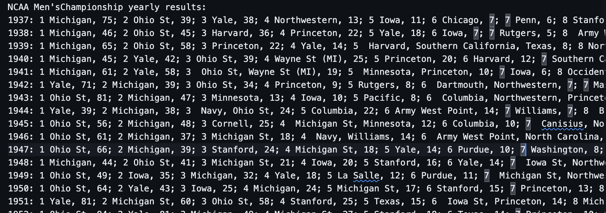

# NCAA Swimming all time team rankings

## A Python data project to calculate and evaluate historical NCAA swimming data. 

This project was created to evaluate all time NCAA Swimming teams results to so that we can better understand how different teams compare to each other. This project uses yearly NCAA championship data with these parameters.

* Wa a team present at a given NCAA champs and did they score?
* What place did the team finish?
* How many points did the team score?

This data is use to calculate the following information.

* The number of times a team has appeared and scored at NCAA's.
* The average finish a team has had at NCAA's.
* The total number of points a team has scored across all NCAA's.

This information is computed for Men's Women's and Combined programs and then ranked by total points and outputted to a txt file.

## How to run this program 

1. Clone this project.
2. Have Python `3.9` or higher installed on your system.
3. Navigate to the `ALL_TIME_SWIMMING_RESULTS` folder.
4. Run the command `python3 main.py` or `python main.py` depending on your operating system.
5. Look inside of your results folder for the newly created output files.

## Exploring results

This was a personal project to answer a question in 2022 about what NCAA swim teams historically were the best. Feel free to download the data. Data was collected from [NCAA championship mens record book](http://fs.ncaa.org.s3.amazonaws.com/Docs/stats/swimming_champs_records/D1Men.pdf) and [NCAA championship womans record book](http://fs.ncaa.org.s3.amazonaws.com/Docs/stats/swimming_champs_records/D1Women.pdf). The data is stored in the [Mens input data file](./input_data/mens_input_data.txt) and the [Womans input data file](./input_data/mens_input_data.txt). The data is stored as `year` followed by the `placement`, `name` and `score` of each team at the NCAA championship that year. To better understand this data the script will reorganize the input data and create two cleaned up data files. [Mens results by year data file](./results/mens_results_by_year.txt) and [Womans results by year data file](./results/womens_results_by_year.txt). If you would like to update the [Mens results by year data file](./results/mens_results_by_year.txt) or [Womans results by year data file](./results/womens_results_by_year.txt) make sure the new data follows this format. Each line starts with the year followed by a `:`. Then grouped by points in descending order separated by a `;` Place, Name of school and points. This will look like `1937: 1 Michigan, 75; 2 Ohio St, 39; 3 Yale, 38;` If two schools tie then the school names are comma separated `6  Dartmouth, Northwestern, 7;`. Data will look like this  The last place finisher does not have a `;` to end the row of data. 

